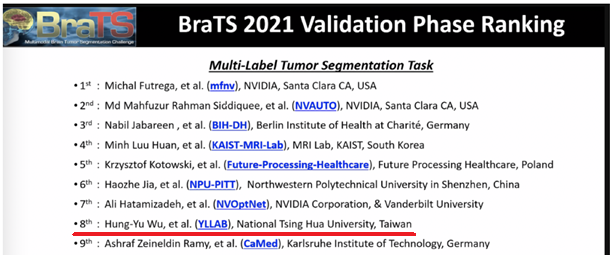

# HarDNet-BTS: An Efficient 3D CNN for Brain Tumor Segmentation
> BrainLes 2021 Paper : [**HarDNet-BTS: A Harmonic Shortcut Network for Brain Tumor Segmentation**](https://link.springer.com/chapter/10.1007/978-3-031-08999-2_21)

> ICCV 2019 Paper : [**HarDNet: A Low Memory Traffic Network**](https://arxiv.org/abs/1909.00948)

## HarDNet Family
#### For Image Classification : [HarDNet](https://github.com/PingoLH/Pytorch-HarDNet) A Low Memory Traffic Network
#### For Object Detection : [CenterNet-HarDNet](https://github.com/PingoLH/CenterNet-HarDNet) 44.3 mAP / 45 fps on COCO Dataset
#### For Semantic Segmentation : [FC-HarDNet](https://github.com/PingoLH/FCHarDNet)  76.0 mIoU / 53 fps on Cityscapes Dataset
#### For Polyp Segmentation : [HarDNet-MSEG](https://github.com/james128333/HarDNet-MSEG) 90.4% mDice / 119 FPS on Kvasir-SEG @352x352

## Main results

  

### Performance on RSNA-ASNR-MICCAI Brain Tumor Segmentation (BraTS) Challenge 2021 Dataset
Validation Phase

| Models       |    | Dice  |       |   | HD95   || FPS|
| :----------: | :----: | :----: | :-----------: | :--------: | :------------: | :---------------: |:--------------: | 
|U-Net         | 0.471  | 0.597  | 0.598         |0.672       | 0.617| 0.894| 11|
|ResUNet |0.572| 0.690 |0.699 |0.745| 0.725| 0.917| 15|
|DoubleUNet |0.733| 0.813 |0.820 |0.861 |0.840 |0.949 |7.5|
|DeepLabv3+[ResNet50] |0.776| 0.857 |0.855 |0.891| 0.8616 |0.961 |28|
|U-Net[ResNet34]| 0.810 |0.876| 0.862 |**0.944**| 0.860 |0.968| 35|
|**HarDNet-MSEG** |**0.848**   |  **0.904**| **0.915**| 0.907| **0.923**| **0.969**|**86.7**|
